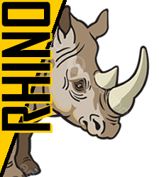

# Utility Server - Technical Documentation Hub | SPIDER, RHINO, MARLIN

  

<h2 align="center">Technical Documentation Hub for Web Performance Optimization</h2>

  <strong>Comprehensive documentation, APIs, and developer tools for web performance optimization.</strong> 
  Access SPIDER (JavaScript prerendering), RHINO (edge HTML caching), MARLIN (AI image optimization), CLI tools, and complete API documentation. 
  Everything you need in one place.

  <a href="https://apis.utility-server.com/">📚 API Docs</a> •
  <a href="https://documents.utility-server.com/">📋 Legal</a> •
  <a href="https://cli-client.utility-server.com/">💻 CLI Tool</a> •
  <a href="#services">🚀 Services</a> •
  <a href="#connect-with-us">💬 Contact</a>

---

## 🚀 Services

**Utility Server** provides enterprise-grade web performance optimization tools and comprehensive technical documentation for developers.

### [📚 APIs](https://apis.utility-server.com/) - Complete API Documentation

**Complete API reference** for TTS Utility Server with **20+ endpoints** for authentication, key management, logging, and Spider module integration. RESTful API with comprehensive examples and use cases.

**Key Features:**
- Authentication & authorization endpoints
- Key management APIs
- Logging and monitoring
- Spider module integration
- OpenAPI specification

---

### [📋 Documents](https://documents.utility-server.com/) - Legal & Compliance

**Legal policies and compliance documentation** including terms & conditions, privacy policy (GDPR, CCPA, LGPD compliant), SLA, disclaimer, and corporate information for Utility Server.

**Includes:**
- Terms and Conditions
- Privacy Policy (GDPR/CCPA compliant)
- Service Level Agreement (SLA)
- Disclaimer & NDA
- Corporate legal information

---

### [💻 CLI Client](https://cli-client.utility-server.com/) - Command-Line Tool

**Command-line tool** for managing Utility Server operations including configuration, client onboarding, caching, logging, and monitoring. Built for developers and system administrators.

**Features:**
- Configuration management
- Client onboarding automation
- Cache control and purging
- Real-time logging
- Performance monitoring

---

### [⚡ RHINO](https://rhino.utility-server.com/) - Edge HTML Caching

**Edge caching module for HTML optimization.** Lightning-fast content delivery with in-memory caching, smart invalidation, and seamless SSR/SSG integration. Supercharge your website performance.

**Benefits:**
- ⚡ Lightning-fast page loads
- 🔄 Smart cache invalidation
- 🔧 SSR/SSG integration
- 📈 Improved Core Web Vitals
- 💰 Reduced server load

---

### [🖼️ MARLIN](https://marlin.utility-server.com/) - AI Image Optimization & CDN

**AI-powered image optimization and CDN service.** Real-time processing with WebP/AVIF support, **reducing CDN costs by up to 40%**. Advanced format conversion and intelligent optimization.

**Features:**
- 🤖 AI-powered optimization
- 🎨 WebP & AVIF support
- 💰 40% CDN cost reduction
- ⚡ Real-time processing
- 🌐 Global CDN delivery

---

### [🕷️ SPIDER](https://spider.utility-server.com/) - JavaScript Prerendering for SEO

**Prerendering module for JavaScript websites.** Enhance SEO and bot visibility by serving pre-rendered content to crawlers and search engines. Perfect for React, Vue, Angular, and other SPA frameworks.

**SEO Benefits:**
- 🔍 Enhanced search engine visibility
- 🤖 Better bot crawling
- 📱 Social media preview cards
- ⚡ Faster initial page load
- 📊 Improved SEO rankings

---

## 🔗 Quick Links

| Service | URL |
|---------|-----|
| **Main Site** | [utility-server.com](https://utility-server.com/) |
| **APIs** | [apis.utility-server.com](https://apis.utility-server.com/) |
| **Documentation** | [documents.utility-server.com](https://documents.utility-server.com/) |
| **CLI** | [cli-client.utility-server.com](https://cli-client.utility-server.com/) |
| **Rhino** | [rhino.utility-server.com](https://rhino.utility-server.com/) |
| **Marlin** | [marlin.utility-server.com](https://marlin.utility-server.com/) |
| **Spider** | [spider.utility-server.com](https://spider.utility-server.com/) |

---

## 💬 Connect With Us

  
  
  
  

- **LinkedIn**: [Utility Server Showcase](https://www.linkedin.com/showcase/utility-server/) - Follow for updates
- **Discord**: [Join our community](https://discord.gg/8ZW5QzCj) - Get support and discuss
- **Telegram**: [@utilityserver](https://t.me/utilityserver) - Quick updates
- **Email**: [enquiry@utility-server.com](mailto:enquiry@utility-server.com) - Business inquiries

---

## 🏢 Our Companies

**Utility Server** is proudly developed and maintained by:

- **[DNS Stack Private Limited](https://www.dnsstack.com)** - Domain and DNS management solutions
- **[TechTonic Systems](https://techtonic.systems)** - Technology infrastructure solutions

---

## 🎯 Why Choose Utility Server?

✅ **Performance Focused** - Optimized for speed and efficiency  
✅ **Developer Friendly** - Comprehensive documentation and APIs  
✅ **Enterprise Ready** - Built for scale and reliability  
✅ **Cost Effective** - Reduce CDN costs by up to 40%  
✅ **SEO Optimized** - Improve search rankings and visibility  
✅ **24/7 Support** - Dedicated technical support team  

---

## 📊 Keywords & Technologies

**Web Performance Optimization** • **Edge Caching** • **Image Optimization** • **JavaScript Prerendering** • **API Documentation** • **CDN Services** • **HTML Caching** • **SEO Tools** • **WebP** • **AVIF** • **React SEO** • **Vue SEO** • **Angular SEO** • **SSR Caching** • **Static Site Generation**

---

## 📝 License & Legal

© 2025 **Utility Server** by DNS Stack Private Limited. All rights reserved.

- [Terms & Conditions](https://documents.utility-server.com/TERMS_AND_CONDITIONS.html)
- [Privacy Policy](https://documents.utility-server.com/PRIVACY_POLICY.html) (GDPR, CCPA, LGPD Compliant)
- [Service Level Agreement](https://documents.utility-server.com/SLA.html)

---

  <strong>Made with ❤️ for developers worldwide</strong> 
  Empowering web performance, one optimization at a time

  <a href="#utility-server---technical-documentation-hub--spider-rhino-marlin">⬆️ Back to Top</a>

